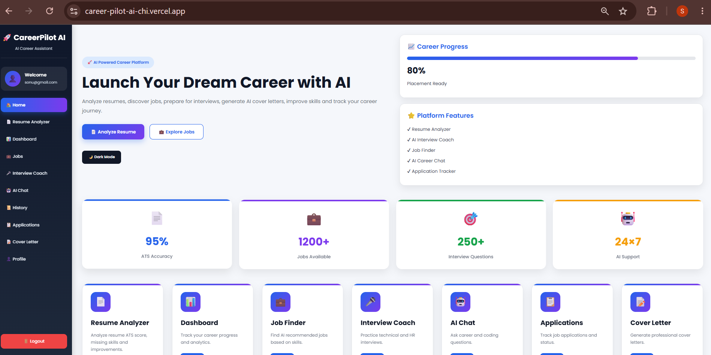
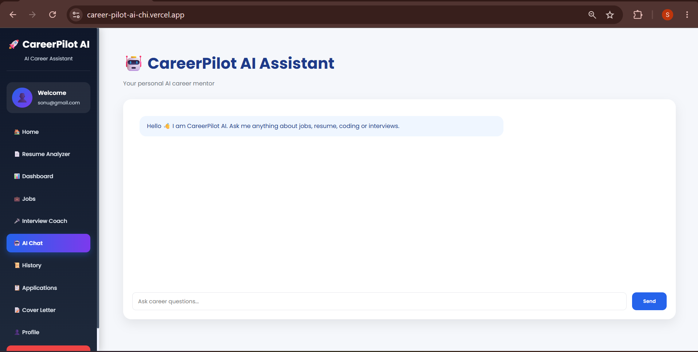
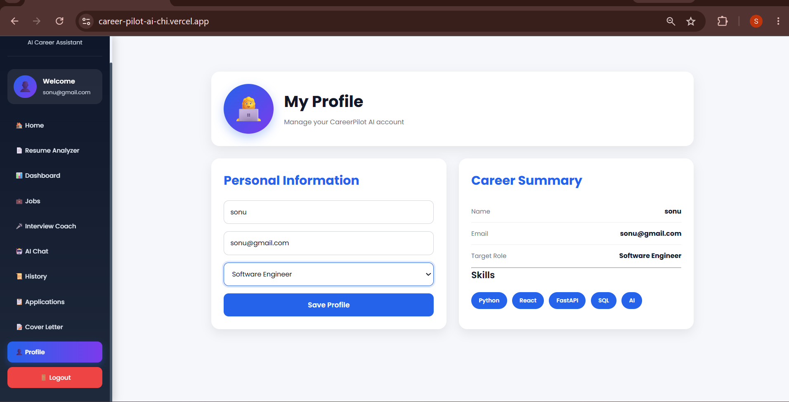

# 🚀 CareerPilot AI

> **An AI-Powered Career Assistant for Students and Job Seekers**

CareerPilot AI is a full-stack web application that helps users improve their career readiness using Artificial Intelligence. It provides AI-powered resume analysis, ATS scoring, interview preparation, job recommendations, skill gap analysis, application tracking, and cover letter generation through an intuitive dashboard.

---

## 🌐 Live Demo

### 🚀 Frontend
https://career-pilot-ai-chi.vercel.app

### ⚡ Backend API (Swagger Docs)
https://careerpilot-ai-backend-aktd.onrender.com/docs

### 💻 GitHub Repository
https://github.com/sonu-balagavi15/CareerPilot-AI

---

# ✨ Features

## 🔐 User Authentication
- Secure User Registration
- User Login
- JWT Authentication
- Protected Dashboard

---

## 📄 AI Resume Analyzer
- Upload PDF/DOCX Resume
- Resume Text Extraction
- ATS Score Calculation
- Skill Identification
- Missing Skill Detection
- AI Resume Suggestions
- Personalized Learning Roadmap

---

## 📊 Career Dashboard
- User Profile Overview
- Career Progress Tracking
- Resume Analysis History
- Completed Activities

---

## 🤖 AI Career Chat
- Career Guidance
- Technical Doubt Solving
- AI Career Suggestions
- Personalized Responses

---

## 🎤 AI Interview Coach
- Role-Based Interview Questions
- Sample Answers
- Technical Topics
- HR Interview Preparation

---

## 💼 AI Job Recommendation
- Skill-Based Job Suggestions
- Career Role Recommendations
- Beginner-Friendly Opportunities

---

## 📈 Skill Gap Analysis
- Compare Skills with Target Role
- Missing Skill Identification
- Learning Recommendations

---

## 📑 Resume Match Score
- Match Resume with Target Job
- Resume Compatibility Percentage

---

## 📋 Application Tracker
- Add Job Applications
- Track Application Status
- Manage Applied Companies

---

## ✉️ AI Cover Letter Generator
Generate professional cover letters using:
- Name
- Company
- Role
- Skills

---

# 🖼️ Project Screenshots

## 🏠 Home Page



---

## 🤖 AI Chat


---

## 💼 Job Recommendation


---

## 📋 Applications



---

## 👤 Profile



---

# 🛠️ Tech Stack

## Frontend
- React.js
- Vite
- JavaScript
- CSS3
- Fetch API

## Backend
- FastAPI
- Python
- SQLAlchemy
- JWT Authentication

## Database
- SQLite

## AI & NLP
- AI API Integration
- Resume Text Extraction
- ATS Score Algorithm
- Skill Gap Analysis

## Deployment
- Vercel (Frontend)
- Render (Backend)

---

# 📂 Project Structure

```
CareerPilot-AI
│
├── backend
│   ├── main.py
│   ├── auth.py
│   ├── database.py
│   ├── models.py
│   ├── resume_analyzer.py
│   ├── ats_score.py
│   ├── skill_gap.py
│   ├── resume_score.py
│   ├── job_recommender.py
│   └── ...
│
├── frontend
│   ├── src
│   │   ├── Dashboard.jsx
│   │   ├── ResumeUpload.jsx
│   │   ├── Chat.jsx
│   │   ├── Jobs.jsx
│   │   ├── Applications.jsx
│   │   ├── CoverLetter.jsx
│   │   ├── Profile.jsx
│   │   └── ...
│
├── screenshots
│   ├── homepage.png
│   ├── aichat page.png
│   ├── job page.png
│   ├── application.png
│   └── profilepage.png
│
└── README.md
```

---

# ⚙️ Installation

## Clone Repository

```bash
git clone https://github.com/sonu-balagavi15/CareerPilot-AI.git

cd CareerPilot-AI
```

---

## Backend Setup

```bash
cd backend
```

Create virtual environment

```bash
python -m venv venv
```

Activate

Windows

```bash
venv\Scripts\activate
```

Install dependencies

```bash
pip install -r requirements.txt
```

Run FastAPI

```bash
uvicorn main:app --reload
```

Backend URL

```
http://127.0.0.1:8000
```

Swagger Documentation

```
http://127.0.0.1:8000/docs
```

---

## Frontend Setup

```bash
cd frontend
```

Install packages

```bash
npm install
```

Run

```bash
npm run dev
```

Frontend URL

```
http://localhost:5173
```

---

# 🔌 API Endpoints

| Method | Endpoint | Description |
|---------|----------|-------------|
| POST | `/register` | Register User |
| POST | `/login` | User Login |
| POST | `/chat` | AI Chat |
| POST | `/analyze-resume` | Resume Analysis |
| POST | `/interview` | AI Interview Coach |
| POST | `/jobs` | Job Recommendations |
| POST | `/skill-gap` | Skill Gap Analysis |
| POST | `/resume-match` | Resume Match Score |
| GET | `/dashboard` | Dashboard |
| GET | `/history` | User History |
| GET | `/applications` | Get Applications |
| POST | `/applications` | Add Application |
| POST | `/cover-letter` | Generate Cover Letter |

---

# 🚀 Future Enhancements

- Resume Builder
- LinkedIn Profile Analysis
- Real-Time Job API Integration
- AI Mock Interview with Voice
- Resume Ranking
- Email Notifications
- Multi-language Support
- Cloud Deployment on AWS

---

# 👨‍💻 Developer

**Sonu Parashuram Balagavi**

**Bachelor of Engineering (Computer Science & Engineering)**

GitHub:
https://github.com/sonu-balagavi15

LinkedIn:
_Add your LinkedIn profile URL here_

---

# ⭐ If you found this project useful

Please consider giving this repository a **Star ⭐** on GitHub.

It motivates me to build more open-source AI projects.

---

## 📜 License

This project is licensed under the **MIT License**.
